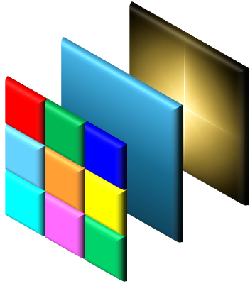
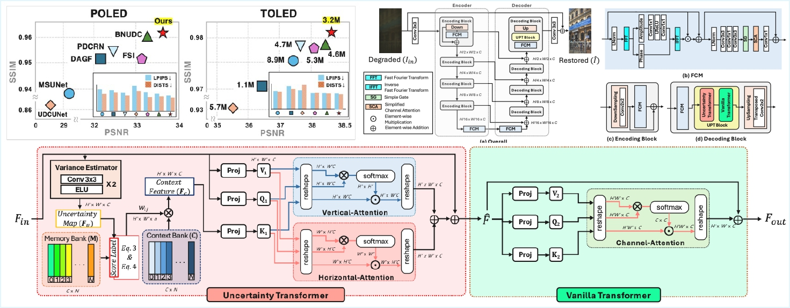
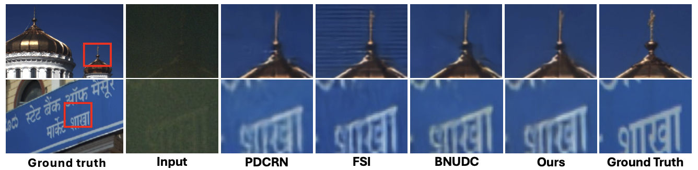
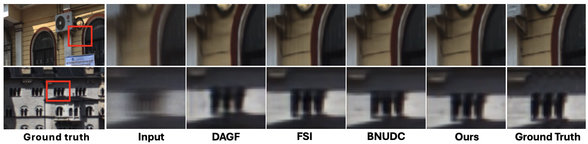

<div align="center">
<!-- <span style="vertical-align: middle;">
  
</span> -->

<span style="vertical-align: middle; margin-left: 15px; display: inline-block; text-align: left;">

<h1 style="margin: 0;">
UCMNet: Uncertainty-Aware Context Memory Network<br>
for Under-Display Camera Image Restoration (CVPR'26)
</h1>

</span>

<p>
  <a href="https://kdhrick2222.github.io/">Daehyun Kim</a><sup>1*</sup>
  ·
  <a href="https://sites.google.com/view/lliger9/home?authuser=0">Youngmin Kim</a><sup>1,2*</sup>
  ·
  <a href="https://sites.google.com/view/lliger9/home?authuser=0">Yoon Ju Oh</a><sup>1</sup>
  ·
  <a href="https://scholar.google.com/citations?hl=ko&user=8soccsoAAAAJ">Tae Hyun Kim</a><sup>1†</sup>
</p>

<p>
<sup>1</sup>Hanyang University &nbsp;&nbsp;
<sup>2</sup>Agency for Defense Development (ADD)
</p>

<p>
<sup>*</sup>Co-first author &nbsp;&nbsp; †Co-corresponding author
</p>

<h3>
<a href="#">Paper</a> |
<a href="https://github.com/kdhRick2222/UCMNet/">Project Page</a>
</h3>


</div>

<p align="center">
  <a href="">
    
  </a>
</p>

> We propose a lightweight Uncertainty-aware Context-Memory Network (UCMNet), for UDC image restoration. Unlike previous methods that apply uniform restoration, UCMNet performs <b>uncertainty-aware adaptive processing to restore high-frequency details in regions with varying degradations.</b>

## Installation
Our implementation follows the experimental settings of previous UDC restoration works (e.g., BNUDC and FSI).  
Please ensure that `scikit-image==0.19.3` is installed.

```bash
pip install -r requirements.txt
```

## Data Preparation
<b>POLED: </b> [https://yzhouas.github.io/projects/UDC/udc.html](https://yzhouas.github.io/projects/UDC/udc.html)

<b>TOLED: </b> [https://yzhouas.github.io/projects/UDC/udc.html](https://yzhouas.github.io/projects/UDC/udc.html)

<b>SYNTH: </b> [https://drive.google.com/drive/folders/13dZxX_9CI6CeS4zKd2SWGeT-7awhgaJF](https://drive.google.com/drive/folders/13dZxX_9CI6CeS4zKd2SWGeT-7awhgaJF)

## Pretrained Weights
<b>POLED: </b> 
```./checkpoints/POLED.pth```

<b>TOLED: </b> 
```./checkpoints/TOLED.pth```

<b>SYNTH: </b> 
```./checkpoints/SYNTH.pth```

## Evaluation

```
python testing_n_saving.py
```

> datasets can be converted by <b>option.py</b>.

<p align="center">
  <a href="">
    
  </a>
</p>

> Visual comparisons on the POLED dataset.

<p align="center">
  <a href="">
    
  </a>
</p>

> Visual comparisons on the TOLED dataset.

## Training
```
python training_n_recording.py
```

## Citation

```
@inproceedings{kim2025UCMNet,
  title={UCMNet: Uncertainty-Aware Context Memory Network for Under-Display Camera Image Restoration},
  author={Daehyun Kim, Youngmin Kim, Yoon Ju Oh, Tae Hyun Kim},
  booktitle={Computer Vision and Pattern Recognition (CVPR)},
  year={2026}
}
```

## Acknowledgement
We gratefully acknowledge the authors of [BNUDC](https://github.com/JaihyunKoh/BNUDC) and [DARKIR](https://github.com/cidautai/DarkIR) for their outstanding work and publicly released code, which laid the foundation for this project. 


